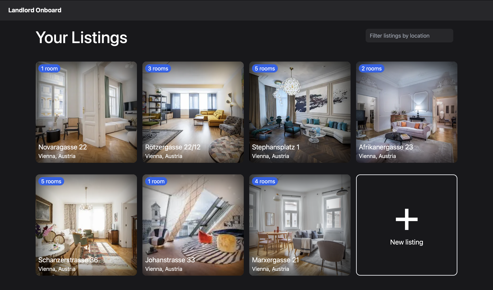

# Landlord Onboard

A website for landlords to upload apartments with rooms to rent to students.

Users can:
- Create an account
- Create an apartment listing with x number of rooms
- Upload an image and add information about each room available for rent.

[Open Deployment on Vercel](https://landlord-onboard.vercel.app)

## Tech Stack
- [Next.js](https://nextjs.org)
- [Tailwind CSS](https://tailwindcss.com)
- [Supabase](https://supabase.com) - Postgres database and authentication

## Setup

1. Create a `.env.local` file and set values
2. `npm run dev`

### Env file

```
NEXT_PUBLIC_SUPABASE_URL=
NEXT_PUBLIC_SUPABASE_ANON_KEY=
```

## Testing
- Jest
- React Testing Library

Run `npm run test`.

## Todo list

- [x] Sign up / login
- [x] Apartments overview page
- [x] Add apartment flow
- [x] Upload room images
- [x] Search / filter apartments
- [x] Handle errors for form submission
- [x] Make apartments overview and edit rooms prettier
- [ ] Edit profile with log out button
- [ ] Tests for create apartment and edit rooms
- [ ] Zip code and city for apartments
- [ ] Allow apartment editing
- [ ] Display price for rooms instead of apartments
